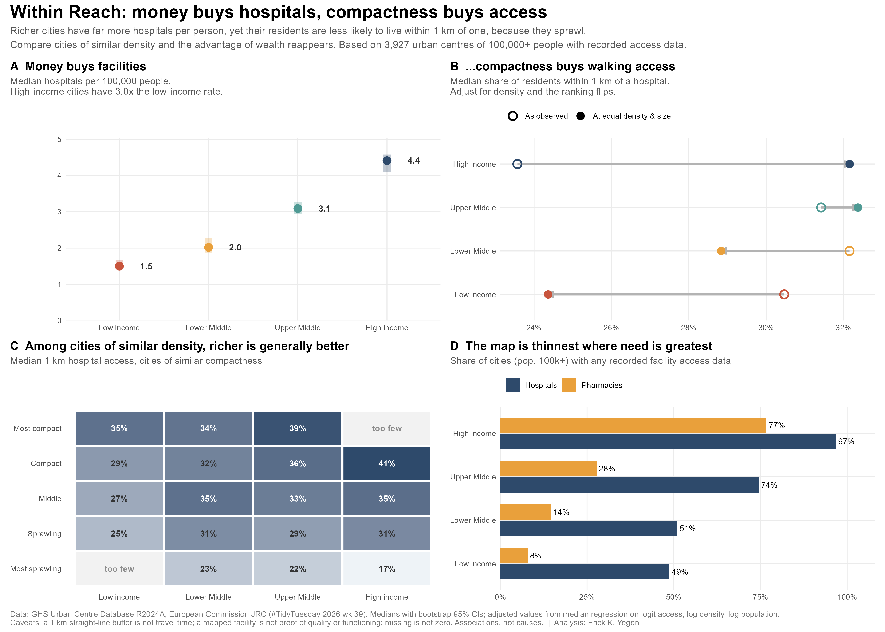

# Within Reach

**[Try the live app →](https://01a0ee6a-97e7-2695-7bb6-f897551993b8.share.connect.posit.cloud/)** · Search any of 11,422 cities and see whether it beats the odds.

**Money buys hospitals; compactness buys access.**
A #TidyTuesday (2026, week 39) analysis of hospital and pharmacy access in 11,422 urban centres, using the GHS Urban Centre Database R2024A (European Commission JRC).

## The story in four findings

1. **Money buys facilities.** High-income cities have about 3x the hospitals per 100,000 residents of low-income cities.
2. **...but not walking access.** Their residents are *less* likely to live within 1 km of a hospital (median 24% vs 30%), because high-income cities are about 2.6x less dense.
3. **Compare like with like and the ranking flips.** At equal density and size, high-income cities reach 32% vs 24% for low-income cities (median regression). Adding UN region reverses it again, because income and region are tightly entangled; this is reported, not hidden.
4. **The map is thinnest where need is likely greatest.** Pharmacy data exist for 8% of low-income cities vs 77% of high-income ones. Hong Kong (4.8M people) has no hospital data at all.

**On the map (poster panel E, and the app's World Map tab):** among the 65 countries with 10+ scored cities, Cuba, Ecuador and Ukraine do best against comparable cities, and Zambia, Iraq and South Africa fall furthest short. Country medians can still be noisy. On the poster the other 111 countries are grey for too few scored cities; in the app you can change that threshold with the slider.

## Project structure

```
within-reach/
├── run_all.R                  # rebuilds everything, in order
├── R/
│   ├── 00_config.R            # every analytic assumption + shared palette/theme
│   ├── 01_import.R            # cached download, explicit schema, integrity checks
│   ├── 02_clean.R             # names, factors, unique labels, rates, data-quality audit
│   ├── 03_process.R           # density bands, confidence grades, peer groups, verdicts
│   ├── 04_analysis.R          # bootstrap CIs, median regressions, coverage, leaderboards
│   ├── 05_map_data.R          # ISO-3 codes + country summary (map tab and poster)
│   ├── 06_static_dashboard.R  # one-page shareable poster (patchwork)
│   └── 07_export_app_data.R   # packages a small .rds for the app
├── app/
│   ├── app.R                  # bslib Shiny app (6 tabs)
│   └── data/app_data.rds      # built by run_all.R
└── output/figures/within_reach_poster.png
```

Each script sources its predecessor, so you can run any step on its own.

## The World Map tab

A country-level choropleth with four lenses: **Beats the odds?** (median gap against comparable cities), **Walking access** (population-weighted share within 1 km), **Hospitals per 100k**, and **Data coverage**. It follows the sidebar filters, has a minimum-cities slider so small countries do not dominate, ranks the highest and lowest countries, and clicking a country lists its cities (click a city to open its profile). The source data has no coordinates, so the map is national rather than city-level; country names are converted to ISO-3 codes at build time in `05_map_data.R`, so the app needs no extra packages.

## Run it

```r
install.packages(c("readr", "dplyr", "tidyr", "stringr", "forcats", "purrr",
                   "ggplot2", "scales", "patchwork", "quantreg",
                   "countrycode", "sf", "rnaturalearth", "rnaturalearthdata", "shiny", "bslib", "bsicons", "plotly", "reactable"))

source("run_all.R")      # from the project root; about 15 seconds
shiny::runApp("app")
```

## Deploy (free) to Posit Connect Cloud

1. Push this folder to a public GitHub repo.
2. In `app/`, run `rsconnect::writeManifest()` and commit the `manifest.json`.
3. At connect.posit.cloud, choose **Publish → Shiny**, pick the repo, and set the primary file to `app/app.R`.

## Methods in brief

- **Frame:** urban centres with 100,000+ residents and a World Bank income group (5,940 cities; 3,927 with hospital access data).
- **Outcome:** share of residents within a 1 km straight-line buffer of a mapped hospital.
- **Peers:** same income group and same density quintile; whole income group if that cell has fewer than 30 cities.
- **Verdicts:** top 20% of peers = *beats the odds*; bottom 20% = *below expected*.
- **Robustness:** a median regression on logit access (income, log density, log population) ranks cities almost identically (Spearman 0.96).

## Data-quality findings worth knowing

- **Censored counts:** the smallest recorded count is 2, so a missing value can mean 0, 1, or unmapped. NA is never treated as zero.
- **Even-number heaping:** 95% of hospital counts and 97% of pharmacy counts are even, consistent with facilities being recorded twice. Absolute counts are indicative only.
- **Access without counts:** 199 centres have an access share but no count (facilities just outside the boundary still reach residents inside).

## Caveats

A 1 km buffer is not travel time. A mapped facility says nothing about quality, capacity, cost, or whether it is currently functioning, which matters in conflict-affected cities. All results are associations, not causes.

---
Analysis: Erick K. Yegon · github.com/erickyegon · linkedin.com/in/erickyegon
